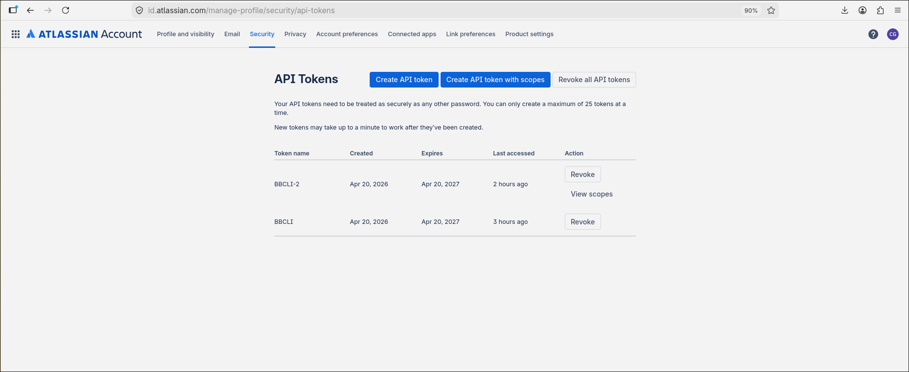
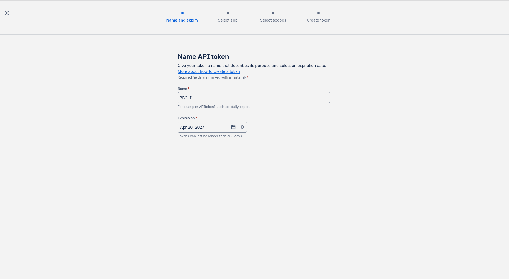
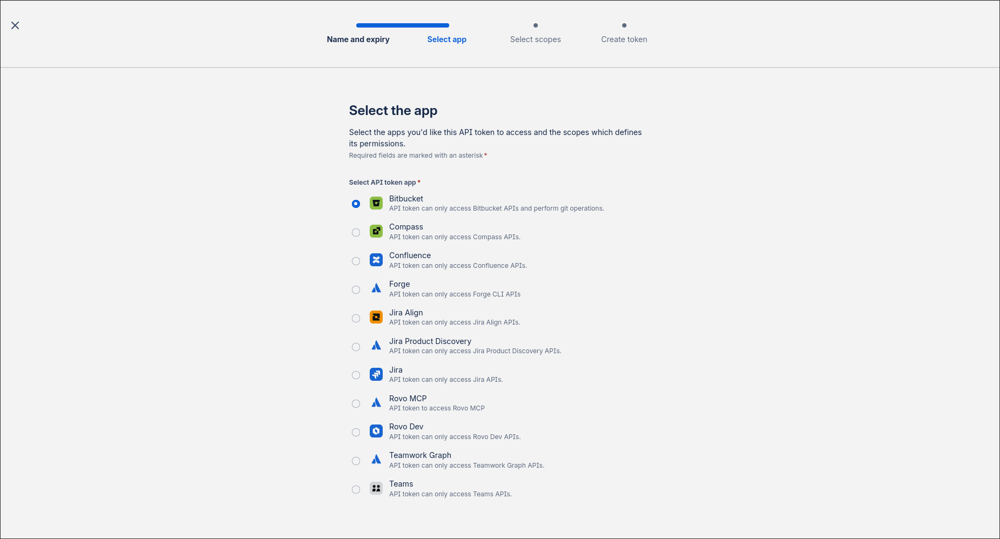
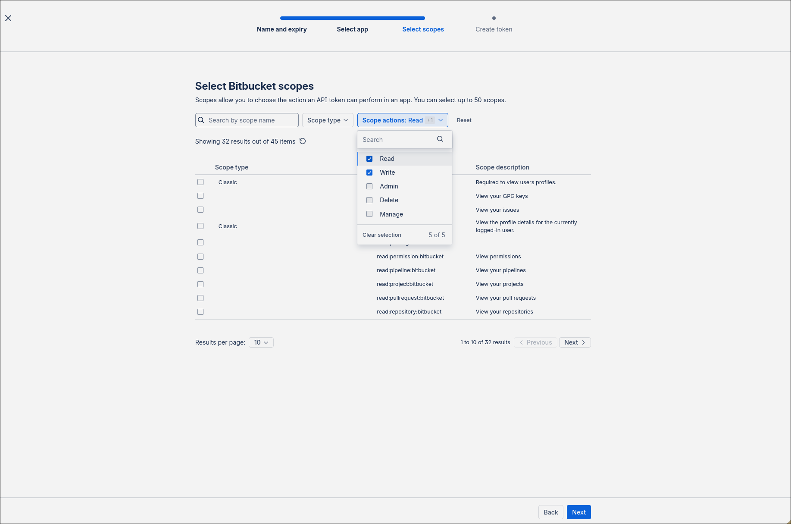

# bbcli

A fast, git-context-aware Bitbucket CLI for day-to-day developer workflows. Run common Bitbucket operations — authenticate, create pull requests, and more — without leaving the terminal.

Built with [Click](https://click.palletsprojects.com/) and [Rich](https://github.com/Textualize/rich). Credentials are stored locally; no third-party service is involved.

## Requirements

- [uv](https://docs.astral.sh/uv/)

## Installation

```bash
git clone https://github.com/MossendSoftware/bbcli
cd bbcli
make install
```

This installs `bb` as an isolated tool into `~/.local/bin`. If that directory is not yet on your `PATH`, run:

```bash
uv tool update-shell
```

then restart your shell. After that, `bb` is available anywhere.

## Authentication

bbcli authenticates against the Bitbucket API using your Atlassian email address and a scoped API token.

### Creating an API token

**1.** Go to <https://id.atlassian.com/manage-profile/security/api-tokens> and click **Create API token with Scopes**.



**2.** Give the token a name (e.g. `BBCLI`) and set an expiry date (maximum 365 days).



**3.** Select **Bitbucket** as the app.



**4.** Under **Scope actions**, check **Read** and **Write**, then click **Next** and create the token.



**5.** Copy the token — it is only shown once.

### Saving credentials

```bash
bb auth login
```

You will be prompted for your Atlassian email and the token you just copied. Credentials are saved to `~/.config/bbcli/credentials.yaml` with mode `600`. To switch accounts, run `bb auth login` again.

## Usage

All commands must be run from inside a Bitbucket git repository (one whose `origin` remote points to `bitbucket.org`).

### `bb auth login`

Prompt for email and API token, verify them against the Bitbucket API, and save to disk.

### `bb pr create`

Create a pull request from the current branch.

```bash
bb pr create
```

bbcli reads the workspace, repository slug, current branch, and default branch directly from git. You are prompted for:

| Prompt | Default |
|---|---|
| Title | Branch name converted to title case (prefix stripped) |
| Destination branch | Detected default branch (`main`, `master`, or `develop`) |
| Description | `$EDITOR` opens with a structured markdown template |

Comment lines (`<!-- ... -->`) are stripped from the description before submission. If the description is left empty, you are asked to confirm before the PR is created.

## Command reference

| Command | Description |
|---|---|
| `bb auth login` | Save Bitbucket credentials to `~/.config/bbcli/credentials.yaml` |
| `bb pr create` | Create a PR from the current branch |

## Development

### Setup

```bash
git clone https://github.com/MossendSoftware/bbcli
cd bbcli
make dev
```

### Project layout

```
src/bbcli/
  cli.py            # Entry point, registers command groups
  api.py            # Bitbucket REST API client
  config.py         # Credential load/save
  git_context.py    # Git remote parsing and branch detection
  commands/
    auth.py         # bb auth *
    pr.py           # bb pr *
```

### Running locally

```bash
uv run bb --help
```

### Running tests

```bash
uv run pytest
```

### Contributing

1. Branch off `main` using a descriptive name: `feat/`, `fix/`, `chore/`, or `docs/` prefix.
2. Open a pull request against `main`. A member of the **Developers** group must approve it before it can be merged.
3. Keep commits focused; squash noise before opening the PR.

### Releasing

Releases follow [Semantic Versioning](https://semver.org/): `v{MAJOR}.{MINOR}.{PATCH}`.

| Change type | Version bump |
|---|---|
| Breaking changes | MAJOR |
| New backwards-compatible features | MINOR |
| Bug fixes, patches | PATCH |

Only members of the **Developers** group may create and push release tags:

```bash
git tag v1.2.3
git push origin v1.2.3
```

Tags must be pushed from a commit on `main`. The tag name must match `v*.*.*` exactly.

## License

[MIT](LICENSE)
